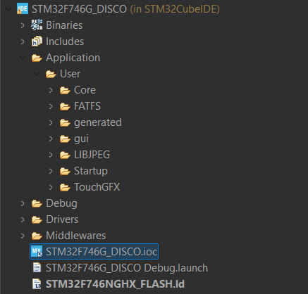
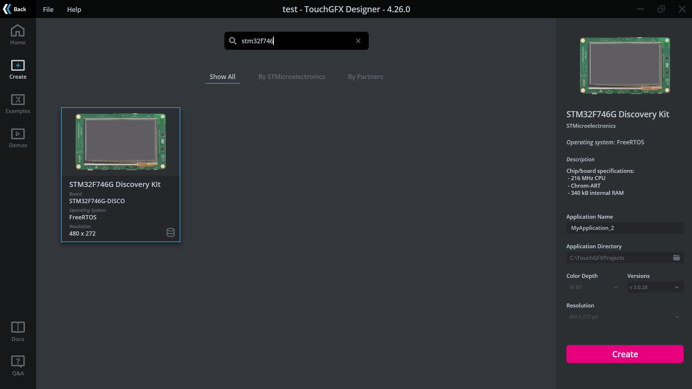
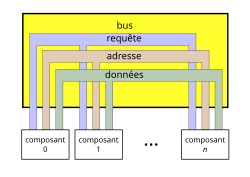

# 2526_PROJET2A_TDI
Total Drive Immersion - Motion System


The objective of this project is to create a 3 axis motion plateform for car racing simulations.
It consist of four linear actuators (with their respective [**drivers**](https://github.com/INBOARDBOT/2526_PROJET2A_TDI/tree/main/HARDWARE/PCB'S/FOC_CONTROLLER_V2)), a Nucleo Discovery which handle
the communication between the drivers and the computer as well as a touchscreen interface.
The data is sent from SimHub to the the Nucleo via UART. Then the position values are distributed to each actuator via an [**RS485**](https://github.com/INBOARDBOT/2526_PROJET2A_TDI/tree/main/HARDWARE/PCB'S/COM_BOARD) bus.

# Achitecture logicielle

L'architecture logicielle est conçue de manière modulaire, segmentant les fonctionnalités du simulateur de conduite en plusieurs sous-systèmes spécialisés. Cette approche permet de séparer les responsabilités et de faciliter la maintenance du système. L'architecture s'articule autour de trois piliers principaux :

Couche Communication : Gère les protocoles d'échange de données entre l'unité centrale et les drivers de vérins (via le bus RS-485), garantissant l'intégrité et la rapidité des transmissions.

Module de Gestion des Actionneurs : Assure le traitement des commandes, le calcul des trajectoires des vérins et le monitoring de l'état des drivers.

Interface Graphique et IHM : Pilote le rendu visuel sur l'écran LCD-TFT et traite les interactions tactiles de l'utilisateur, tout en gérant les ressources stockées en mémoire Flash.

## Organistaion du projet
<br>
* `Application/` Contient la logique métier principale développée par l'utilisateur.
    * `gui/` et `generated/` Dédiés à l'interface graphique (typiquement pilotés par TouchGFX sur le F746G). Regroupe le backend (logique) et le frontend (assets et code généré).
    * `Core/` Noyau de l'application gérant la communication et la supervision de la centrale avec le reste du système de simulation.
* `Driver/` Regroupe les couches d'abstraction matérielle (BSP : gestion des composants externes). 
* `Debug/` Répertoire de sortie du compilateur.

## Présentation des Composants

### Unité Centrale
<br>
La centrale controle l'enssemble du systeme de simulation, elle doit etre reactive et embarquer une interface graphique servant d'IHM. Voici donc les principales fonctionnalites que la carte STM32F746G nous propose :
* Puissance de calcul : Architecture Arm Cortex STM32F746NGH6
* Interactions avec l'utilisateur (IHM) : Ecran tactile 4.3” RGB 480×272 color LCD-TFT
* Stockage des ressources graphiques lourdes commes les imges : 128-Mbit Quad-SPI Flash memory

Fonctionnalitees addiotionnelles petinentes :
* Gestion Audio intégrée : Audio line in and line out jack & Stereo speaker outputs


### Driver de vérin
[photo]
Les drivers des verrins permettent de faire l'interface entre les ordres transmis par la centrale et l'action entrepris par les verrins. Il est compose des elements suivants :


### Interface de Communication (Bus RS-485)
[photo]
L'interface de communication est une carte électronique intermédiaire positionnée entre l'unité centrale et les différents actionneurs (vérins).

Pour surmonter la contrainte de la distance physique et garantir une transmission rapide et immunisée contre les parasites, la liaison s'appuie sur la norme RS-485. Ce standard utilise une signalisation différentielle particulièrement fiable en milieu industriel.

L'interface assure la conversion des signaux : elle transforme le protocole UART (TTL) de la centrale en signaux différentiels pour le bus, puis les drivers des vérins effectuent la conversion inverse pour traiter l'information. L'ensemble des drivers est raccordé en parallèle selon une topologie en bus, permettant une gestion simplifiée du câblage.

## Environnement de Développement
Le développement du projet repose sur une chaîne d'outils intégrée, permettant de gérer aussi bien la configuration matérielle que l'interface utilisateur et le versionnage du code.

`STM32CubeIDE` <br>
Il s'agit de l'environnement de développement (IDE) "tout-en-un" fourni par STMicroelectronics.

* Configuration : Intègre STM32CubeMX pour configurer graphiquement les périphériques (UART, RS-485, Horloges) et générer le code d'initialisation.

* Développement & Debug : Permet l'écriture du code en C/C++ et offre des outils de débogage avancés (lecture de registres en temps réel, analyseur de variables).

* Compilation : Utilise le compilateur GCC pour optimiser les performances du processeur Cortex-M7.

`TouchGFX Designer` <br>
Framework graphique avancé spécifiquement optimisé pour les microcontrôleurs STM32.

* Design UI : Permet de concevoir l'interface de manière visuelle pour ensuite developper en C++ dessus.

* Performance : Tire parti de l'accélérateur matériel Chrom-ART de la carte pour obtenir des animations fluides (60 FPS) sans surcharger le processeur.

* Synchronisation RTOS : S'intègre avec FreeRTOS pour séparer le thread de rendu graphique des threads critiques de communication et de calcul (Backend/Frontend).

`GitHub` <br>
Plateforme d'hébergement et de gestion de versions basée sur l'outil Git.

* Collaboration : Centralise le code source pour permettre à plusieurs développeurs de travailler simultanément sur différents modules (centrale, drivers) via un système de branches.

* Documentation : Héberge le présent fichier README et la documentation technique associée pour une meilleure visibilité du projet.


# Interface Graphique
<br>
L'interface graphique (IHM) permet de visualiser en temps réel l'état du système de simulation. Elle offre à l'utilisateur une plateforme interactive pour piloter le simulateur, lancer les procédures de calibration et ajuster les paramètres de conduite.

## TouchGFX Designer
TouchGFX Designer est l'outil utilisé pour concevoir l'environnement visuel. Il génère un code C++ optimisé qui tire parti des capacités d'accélération matérielle du STM32.

### Creation du projet
La première étape consiste à sélectionner le BSP (Board Support Package) correspondant à notre matériel : le `STM32F746G Discovery Kit`.<br>
<br>

[!IMPORTANT] Cette étape est cruciale car TouchGFX génère non seulement l'interface, mais aussi toute la structure du projet (fichiers de configuration, drivers d'écran, gestion de la mémoire) que nous importerons ensuite dans STM32CubeIDE.

### Architecture de l'interface
L'interface est découpée en plusieurs Écrans (Screens). Chaque écran possède son propre fichier de vue (View) et son présentateur (Presenter), permettant de séparer la logique graphique de la logique métier.

#### Ecran
Les vues du simulateur
Pour garantir une navigation fluide, nous avons segmenté l'IHM en quatre écrans principaux :

* SimHubScreen : Le tableau de bord principal. Il affiche les données télémétriques en temps réel, telles que l'extension des vérins et la consommation électrique des drivers.

* LoadingScreen : Une interface de transition utilisée lors des processus lourds, typiquement durant la phase de calibration automatique des vérins.

* MenuScreen : Le point d'entrée central permettant à l'utilisateur de naviguer entre les différentes sections.

* SettingScreen : Un espace dédié à la configuration logicielle et matérielle du système.

<br>

Avoir une multitude d'ecran permet de faciliter le developpement des differents UI. 

#### Composants et Outils
L'IDE propose deux types de blocs de construction pour concevoir les écrans :

1. Les Widgets : Ce sont les éléments de base (boutons, zones de texte, jauges, formes géométriques). Ils sont entièrement personnalisables pour correspondre à la charte graphique du simulateur.

2. Les Conteneurs (Containers) : Ils permettent de regrouper plusieurs widgets au sein d'une même entité. Cela facilite la création de fenêtres modales, de listes déroulantes ou de menus complexes.

Vous pouvez retrouver ci-dessous la documentation sur les outils et conteneurs pour en apprendre d'avantages [Contenuer/Outil](https://support.touchgfx.com/docs/development/ui-development/working-with-touchgfx/widgets-and-containers)


### Generer le projet
Une fois le design finalisé, l'outil génère le code source. Ce processus inclut :

* La conversion des images en tableaux de données stockés en Flash QSPI.

* L'implémentation de l'API graphique compatible avec FreeRTOS.

* La configuration des périphériques de la carte (écran, tactile, DMA2D).

[!NOTE] Bien que TouchGFX Designer soit puissant, il se limite à la couche visuelle. Les interactions complexes (ex: cliquer sur un bouton pour activer un vérin) nécessitent une implémentation manuelle dans le code C++ généré, via des fonctions de rappel (Callbacks).

## Backend and Frontend communication
Le défi majeur consiste à faire communiquer l'interface utilisateur avec le reste du système (capteurs, bus RS-485). TouchGFX utilise une architecture structurée pour séparer l'affichage de la logique métier.<br>

Définitions
* Le Frontend (La Vue) : Comprend les composants visibles à l'écran. Il est responsable de l'affichage des données et de la capture des interactions utilisateur.

* Le Backend (Le Système) : Représente tout ce qui se passe en dehors de l'interface (réception des données RS-485, calculs de trajectoires, mesures de courant).

L'Architecture MVP (Model-View-Presenter)<br>
<br>
Pour assurer une synchronisation fluide sans bloquer l'affichage, TouchGFX s'appuie sur trois couches :

1. Le Model : C'est le point d'entrée du Backend. Il reçoit les événements extérieurs (ex: nouvelle mesure de courant) et les stocke temporairement.

2. Le Presenter : Il agit comme un pont. Il surveille les changements dans le Model et ordonne à la View de se mettre à jour.

3. La View : Elle reçoit les ordres du Presenter et modifie visuellement les widgets (ex: mettre à jour la valeur d'une jauge).

vous pouvez visualiser cette video qui explique en detail comment afficher une valeur sur l'interface graphique [video](https://www.youtube.com/watch?v=Y7d6-59YQu8)


# Protocole de Communication
Comme expliqué précédemment, la liaison entre la centrale et les drivers repose sur une couche physique RS-485. Bien que les signaux en entrée et en sortie de l'interface soient au format UART, le support physique RS-485 permet de transporter ces données sur de longues distances tout en supportant une topologie réseau de type "Bus".

## Architecture Maître-Esclave
Pour organiser les échanges sur ce canal partagé, nous utilisons une architecture Maître-Esclave :

* Le Maître (Centrale) : Il est l'unique initiateur de la communication. Il interroge ou envoie des ordres aux drivers.

* Les Esclaves (Drivers) : Ils "écoutent" en permanence le bus et ne répondent ou n'agissent que lorsqu'ils sont explicitement sollicités par le maître.


## Principe du Bus de Communication 
Dans cette configuration, tous les esclaves sont branchés en parallèle sur la même ligne physique. Pour éviter que tous les vérins ne s'activent en même temps, nous utilisons un système d'adressage et de trames de données : <br>
<br>

1. L'Adressage : Chaque driver possède un identifiant unique (ID). Le message envoyé par la centrale commence par l'adresse de destination.

2. Le Filtrage : Tous les drivers reçoivent le signal, mais seul l'esclave dont l'adresse correspond à celle contenue dans le message traite l'information. Les autres ignorent la trame.

3. Les Données (Payload) : Une fois l'adresse validée, l'esclave décode les instructions (ex: consigne de position, vitesse, ou demande d'état).

## Gestion du flux (Half-Duplex)
<br>
Le bus RS-485 utilisé est généralement Half-Duplex : la centrale et les drivers partagent la même paire de fils pour émettre et recevoir.

Point d'attention : La centrale doit libérer le bus (repasser en mode réception) immédiatement après avoir envoyé une commande pour permettre à l'esclave de renvoyer son accusé de réception ou ses données de télémétrie.

## Structure de communication
<p align="justify">Afin d'optimiser les échanges de données avec les quatre esclaves du système, nous utilisons un protocole de cycle séquentiel. Le maître initie une transmission/réception itérative de l'esclave 0 à l'esclave 3. Au cours de chaque cycle, le maître récupère l'intégralité des données de l'esclave ciblé et les traite avant de passer au suivant. </p>

### Paquet de Données
<p align="justify">Le paquet de données est l'élément central de notre protocole. Il agit comme un conteneur standardisé permettant de transporter efficacement les commandes et les retours d'état.</p>

Voici la structure logicielle du paquet :

```
typedef struct __attribute__((packed))
{
    uint8_t startByte;   
    uint8_t address;     
    uint8_t cycleId;     
    
    uint8_t statusFlags; 
    uint8_t payloadCount; 

    union {
        struct {
            uint8_t type;    
            uint8_t code;    
        } fifoEntries[MAX_DATA / 2];

        uint16_t infoArray[MAX_DATA / 2]; 
        
        uint8_t rawBytes[MAX_DATA];
    } payload;

    uint8_t checksum;
    uint8_t stopByte;    
} MotionPacket_t;
```

Caractéristiques de Transmission
* <p align="justify">Standard UART : Le type uint8_t est utilisé comme unité de base, conformément au standard de communication série UART.</p>

* <p align="justify">Résolution des données : Les données système (telles que celles fournies par SimHub) sont quantifiées sur 16 bits. Par conséquent, chaque valeur dans infoArray occupe deux octets (uint8_t) lors de la transmission série.</p>


### Flag 
Les `Flags` ou `Drapeaux` en francais sont des informations actuelles sur le systeme d'une longueur d'un seul bit. Voici les differents que s'echangent le master et les slaves.

_Flag Master_
| Flag info     | Position bit  |
| ------------- |:-------------:|
| EMPTY_DATA    | 0             |
| CYCLE_ID_RST  | 1             |
| ACK_REQUEST   | 2             |
| TO_DEFINE     | 3             |
| TO_DEFINE     | 4             |
| TO_DEFINE     | 5             |
| TO_DEFINE     | 6             |
| TO_DEFINE     | 7             |

EMPTY_DATA   : Inform the slave it doesn't need to look for data in the packet<br>
CYCLE_ID_RST : Inform the slave the cycle id is reset (to 0)<br>
ACK_REQUEST  : Inform the slave to respond with flag ACK


_Flag Slave_
| Flag info     | Position bit  |
| ------------- |:-------------:|
| ACK           | 0             |
| INIT_DONE     | 1             |
| MOTOR_EN      | 2             |
| MOTOR_MOVING  | 3             |
| BUSY          | 4             |
| EMPTY_DATA    | 5             |
| EMPTY_STATUS  | 6             |
| TO_DEFINE     | 7             |

ACK          : Inform the master that his message is acknowledged<br>
INIT_DONE    : Inform the master the initialisation is done (the system is calibrated)<br>
MOTOR_EN     : Inform the master that the motor are enabled to move<br>
MOTOR_MOVING : Inform the master the motor are moving<br>
BUSY         : Inform the master the slave can't take instruction at the moment<br>
EMPTY_DATA   : Inform the master to not look for data<br>
EMPTY_STATUS : Inform the master to not look for errors or events<br>

### Evenements
Les événements sont des alertes asynchrones envoyées par les esclaves pour informer d'un changement d'état opérationnel.<br>

Voici la liste evenements recenses :
_Flag Slave_
| Evenement              | Code           |
| ---------------------- |:--------------:|
| EVT_NONE               | 0x00           |
| EVT_MOVEMENT_STARTED   | 0x01           |
| EVT_MOVEMENT_COMPLETED | 0x02           |
| EVT_TARGET_REACHED     | 0x03           |
| EVT_LIMIT_SWITCH_MIN   | 0x04           |
| EVT_LIMIT_SWITCH_MAX   | 0x05           |
| EVT_HOMING_STARTED     | 0x06           |
| EVT_HOMING_COMPLETED   | 0x07           |
| EVT_DRIVER_ONLINE      | 0x08           |
| EVT_DRIVER_OFFLINE     | 0x09           |
| EVT_PARAM_CHANGED      | 0x0A           |


EVT_NONE : No event <br>              
EVT_MOVEMENT_STARTED : The slave piston has started its movement <br>  
EVT_MOVEMENT_COMPLETED : The slave piston has completed its movement<br>
EVT_TARGET_REACHED : The slave piston is a the requested position<br>    
EVT_LIMIT_SWITCH_MIN : The slave piston is at the minimum position<br>  
EVT_LIMIT_SWITCH_MAX : The slave piston is at the maximum position<br>  
EVT_HOMING_STARTED : The slave piston is performing homing<br>    
EVT_HOMING_COMPLETED : The slave piston has completed its homing<br>  
EVT_DRIVER_ONLINE : The slave is now offline wait to be restarted<br>     
EVT_DRIVER_OFFLINE : The slave is now online and can perform operation <br>     
EVT_PARAM_CHANGED : The slave has succesfully changed its parameter <br>      

### Erreurs
Les erreurs sont des alertes asynchrones signalant un dysfonctionnement ou une anomalie sur un esclave.<br>

Voici la liste evenements recenses :
_Flag Slave_
| Erreur                 | Code           |
| ---------------------- |:--------------:|
| ERR_NONE               | 0x00           |
| ERR_INVALID_COMMAND    | 0x01           |
| ERR_INVALID_PARAM      | 0x02           |
| ERR_TIMEOUT            | 0x03           |
| ERR_CHECKSUM_FAIL      | 0x04           |
| ERR_UNSUPPORTED        | 0x05           |
| ERR_STALL_DETECTED     | 0x06           |
| ERR_UNDERVOLTAGE       | 0x07           |
| ERR_UNDERVOLTAGEMCU    | 0x08           |
| ERR_FAILED_CALIB       | 0x09           |
| ERR_FAILED_SET_PIS_POS | 0x0A           |
| ERR_COMM_LOST          | 0x0B           |
| ERR_FRAME_INVALID      | 0x0C           |
| ERR_OVERHEATING        | 0x10           |
| ERR_OVERCURRENT        | 0x11           |
| ERR_OVERVOLTAGE        | 0x12           |
| ERR_OVERVOLTAGEMCU     | 0x13           |

Les erreurs critiques se différencient par le préfixe 0x1-. Elles entraînent généralement une mise en sécurité immédiate du matériel.<br>

ERR_NONE : No error <br>
ERR_INVALID_COMMAND : Command instruction not found <br>    
ERR_INVALID_PARAM : Packet parameter is invalid <br>      
ERR_TIMEOUT : Slave sends it when it takes too much time to do an operation<br>            
ERR_CHECKSUM_FAIL : Checksum of packet failed <br>              
ERR_STALL_DETECTED : Piston does not move even though it is instructed to (physical struggle) <br>    
ERR_UNDERVOLTAGE : Piston under voltage <br>      
ERR_UNDERVOLTAGEMCU : MCU is under voltage <br>   
ERR_FAILED_CALIB : Slave failed calibration <br>      
ERR_FAILED_SET_PIS_POS : Slave failed to set to the correct position <br>
ERR_COMM_LOST : Slave lost communication with master <br>         
ERR_FRAME_INVALID : Packet structure is giberish <br>     
ERR_OVERHEATING : Critic error piston is over heating <br>       
ERR_OVERCURRENT : Critic error piston is short circuiting <br>       
ERR_OVERVOLTAGE : Critic error piston is over voltage <br>       
ERR_OVERVOLTAGEMCU : Critic error MCU is over voltage <br>    

### Synchronizer les echanges
Le système de communication utilise un identifiant de synchronisation nommé `cycleId`. Cet octet permet de marquer chaque cycle de communication maître-esclave afin de s'assurer que tous les périphériques sont parfaitement synchronisés.<br>

Fonctionnement du CycleId
À chaque nouvelle interrogation de la chaîne d'esclaves (de 0 à 3), le Maître incrémente la valeur du cycleId. Cette valeur agit comme une horloge de synchonization temporel :

* Validation : L'esclave doit répondre en incluant le cycleId qu'il vient de recevoir.

* Détection de retard : Si un paquet esclave arrive avec un cycleId différent de celui attendu par le Maître, il est considéré comme obsolète ou corrompu.

* Intégrité temporelle : Cela évite que le Maître traite des données de télémétrie "anciennes" (provenant d'un cycle précédent) qui pourraient provoquer des saccades ou des erreurs de calcul dans le moteur de mouvement (Direct Drive ou Pistons).

### Queue slave
FIFO qui se remplie d'erreur et d'evenement, se vide a chaque fois que slqve envoie un packet au master.

### Recapitulatif
Master - Slave synchonization cycle  


## Driver - Traitement des informations
[!En cours de developpement]

## Centrale - Traitement des informations
[!En cours de developpement]

### Machine a etat fini
[!En cours de developpement]

### Update
[!En cours de developpement]

### TimeOut
[!En cours de developpement]

## Synchronisation avec l'API graphique

### Gestion des Tâches (RTOS)

### Synchronisation de thread

#### Semaphore


# Manipuler SimHub
SimHub est un logiciel qui sert de plug-in a different jeu de course, il permet de recuperer des informations sur la physique du jeu comme les vibrations ou la position en temps reel de l'habitacle. Nous utilsons ces donnees comme la source pour l'entree de notre simulateur de course.
## Motion output
Le motion output est l'onglet de simhub qui nous permet de configurer une communication serie personnalise, nous pouvons aussi y regler les parametres sur les dimensions du siege de conduite qui impact directement les calculs de position.

### Parametres de communication
Pour une communication serie nous pouvons regler les differents parametres ici, les characteres de start et stop configure le demarrage et l'arret de la communication entre la centrale et simhub. La resolution des valeurs de position sont sur 16 bits.

### Simple configuration UART
Depuis la centrale nous pouvons coder un simple code de reception pour recevoir les informations sur position du vehicule en temps reel : <br>

#### Configuration du port de communication serie
<br>

#### Code simple de reception

```
#include "main.h"

uint16_t sensorData[4];
uint8_t tempBuffer[8];
int byteCount = 0;
bool syncFound = false;

void Update_UART_Communication(void) {
    if (UART7->ISR & USART_ISR_RXNE) {
        uint8_t receivedByte = (uint8_t)(UART7->RDR); 

        if (receivedByte == 0x44) {
            syncFound = true;
            byteCount = 0;
        } 
        else if (receivedByte == 0x45 && syncFound) {
            if (byteCount == 8) {
                for (int i = 0; i < 4; i++) {
                    sensorData[i] = (uint16_t)(tempBuffer[i*2] | (tempBuffer[i*2+1] << 8));
                }
                // Traitement des données ici
            }
            syncFound = false;
        } 
        else if (syncFound) {
            if (byteCount < 8) {
                tempBuffer[byteCount++] = receivedByte;
            } else {
                syncFound = false;
            }
        }
    }
}

int main(void) {
    // Initialisation HAL...
    
    while (1) {
        Update_UART_Communication();
    }
}
```


# Resources 
Documentation de la carte STM32F746G [link1](https://www.st.com/en/evaluation-tools/32f746gdiscovery.html#st_description_sec-nav-tab) <br>
Documentation de l'API graphique TouchGFX [link2](https://support.touchgfx.com/docs/introduction/welcome)<br>
Documentation RTOS sur la synchronization de threads [link3](https://arm-software.github.io/CMSIS_5/RTOS/html/cmsis__os_8h.html)<br>
